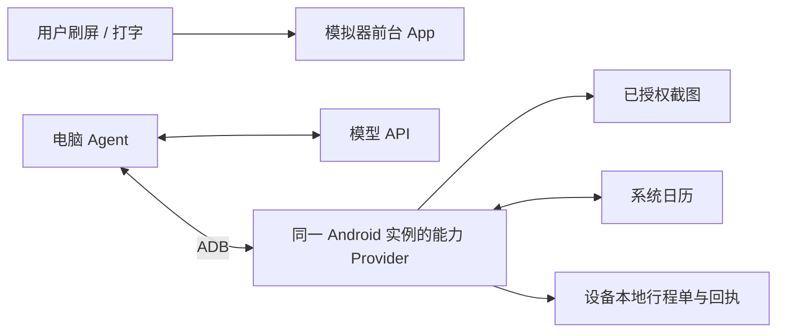

# Wellphone

用户在 Android 前台刷屏、打字时，Agent 同时完成设备任务。**当前为调研与设计阶段，尚无可运行 APK，也没有设备实验结果。** 按现有设备条件，开发与演示以单个 Android 模拟器为主，真机可选。

首选方案：Android 模拟器 + 电脑 Agent + Android 端受控 ContentProvider。首个任务是把设备中预先授权的行程截图整理为真实日历事件，并读回核验。通过系统数据接口执行，全程不需要点击主屏或切换输入法。副屏 GUI 自动化列为扩展实验。

**计划部署步骤**（实现后补充可执行命令）：

1. 用 Linux / Windows / macOS 安装 Android Studio、SDK 和 Platform Tools，创建一个 API 34/35 AVD。
2. 在该模拟器中准备前台使用 App 和可写系统日历；用户和 Agent 必须使用同一个 AVD 实例。
3. 安装 Companion，预先选择截图、授权日历并选择可写日历；随后用户回到自己的 App。
4. 在电脑配置 `.env`、启动 Agent，执行任务并检查手机日历读回结果；任务期间不打开 Companion 界面。

| 环境变量 | 用途 |
| --- | --- |
| `OPENAI_API_KEY` | 模型服务密钥，只保存在电脑本地 |
| `OPENAI_BASE_URL` | 当前模型服务地址；接口兼容性待验证 |
| `LLM_MODEL` | 模型名称；图像输入和结构化输出能力待验证 |

`.env`、手机截图和原始运行记录不入库。连接指定设备、任务配置等参数待实现时定义。

- [方案设计](docs/superpowers/specs/2026-09-21-wellphone-design.md)：任务、架构、接口、可靠性及路线取舍。
- [资料调研](docs/research/2026-09-21-platform-research.md)：Android / iOS / 模拟器边界及第一手来源。
- [验证与演示计划](docs/validation/2026-09-21-feasibility-and-demo.md)：先验证什么、7 天安排、1–2 分钟演示。

范围：首版覆盖已授权截图和系统日历，不承诺任意第三方 App 后台操作。模拟器演示可以完成当前范围；原题的真机部署项仍属未覆盖，有设备后补验。
