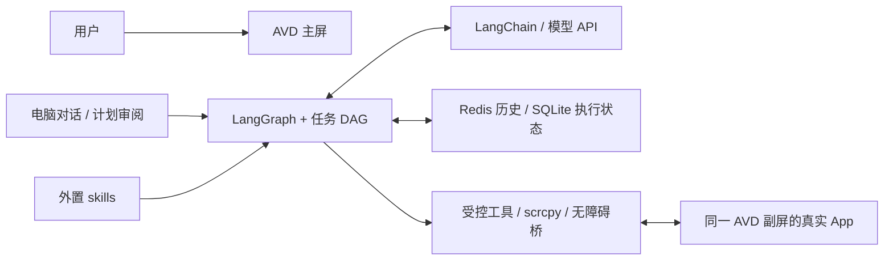

# Wellphone

用户在 Android 主屏刷屏、打字，Agent 在**同一个 Android 实例的虚拟副屏**操作真实 App。**当前仅完成调研与设计，尚无可运行程序或设备实验结果。** 开发与演示以单个官方 Android 模拟器为主，真机可选。

方案：LangGraph 通用编排 + LangChain 消息/模型适配 + 可修改的任务 DAG + 外置 skills + 受控 GUI 工具。计划演示行程截图转日历、查询/创建腾讯会议、按需求点外卖；三者共用执行器，通过真实 App 界面完成，不接业务 API。副屏焦点、中文输入和 App 兼容性是首轮实验门槛。

**计划部署步骤**（实现后补充可执行命令）：

1. 安装 Android Studio / SDK / Platform Tools，创建 API 34/35 AVD；准备主屏使用 App、图库/日历、一个外卖 App 和腾讯会议，预先登录。
2. 编译固定版本的 scrcpy 副屏补丁及 Android 无障碍桥，完成授权；验证主屏持续中文输入时副屏不抢焦点或键盘。
3. 启动带持久化的本地 Redis；配置模型与设备参数，启动电脑 Agent 和控制台。SQLite 状态与截图保存在本地。
4. 运行通用 Agent，查看 DAG、动作和证据；从真实 App 列表重新打开结果核验。下单与支付按具体授权执行并分别报告状态。

| 环境变量 | 用途 / 状态 |
| --- | --- |
| `OPENAI_API_KEY`、`OPENAI_BASE_URL`、`LLM_MODEL` | 已有模型配置；图像输入、结构化输出和 GUI 定位待验证 |
| `REDIS_URL` | 拟定：会话历史连接地址 |
| `ANDROID_SERIAL` | 拟定：唯一目标 AVD；副屏 ID 由会话管理器分配 |
| `WELLPHONE_STATE_DIR`、`WELLPHONE_SKILLS_DIR` | 拟定：本地状态/证据目录与产品技能目录 |

上述新增配置名尚未接入代码。`.env`、截图、账号数据和原始轨迹不入库；产品 `skills/` 与开发助手的 `.agents/skills/` 分开。

- [主设计](docs/superpowers/specs/2026-09-21-wellphone-design.md) · [运行时契约](docs/superpowers/specs/2026-09-21-agent-runtime-contracts.md)：工具、skills、DAG/replan、消息和恢复。
- [本轮资料核验](docs/research/2026-09-21-agent-runtime-and-gui-research.md) · [平台研究与历史路线](docs/research/2026-09-21-platform-research.md)：三份用户参考及官方源码依据。
- [验证与演示计划](docs/validation/2026-09-21-feasibility-and-demo.md)：实验门槛、三个演示、7 天安排和未通过时的处理。

范围：单用户、单进程、单 AVD、单副屏、单活动任务；只承诺通过实测的 App/页面。模拟器验证不等于原题的物理手机部署，该项有设备后补验。
