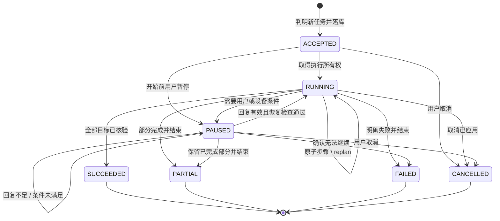
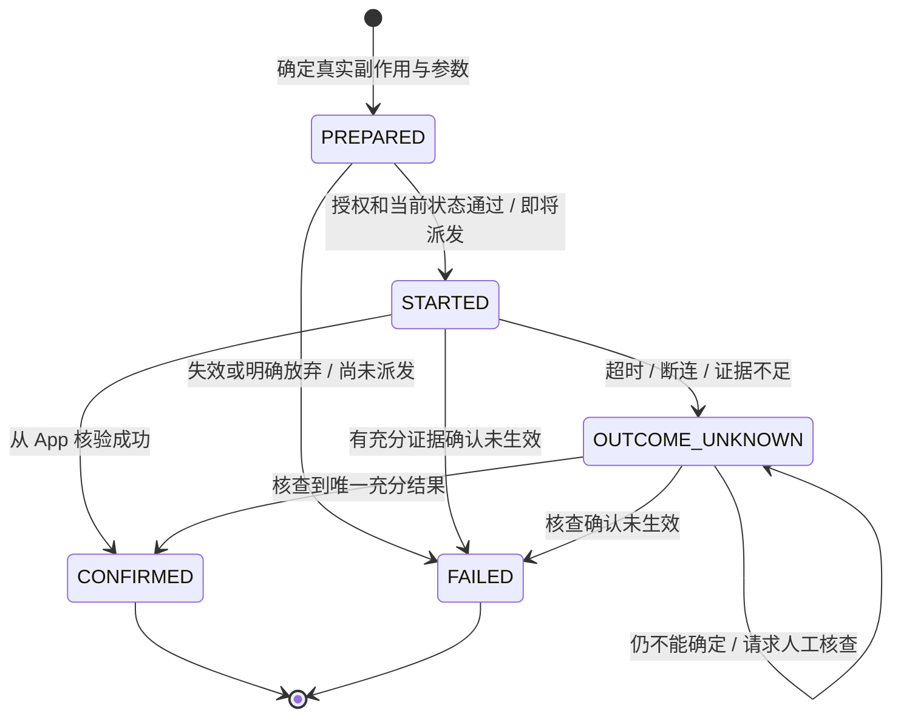
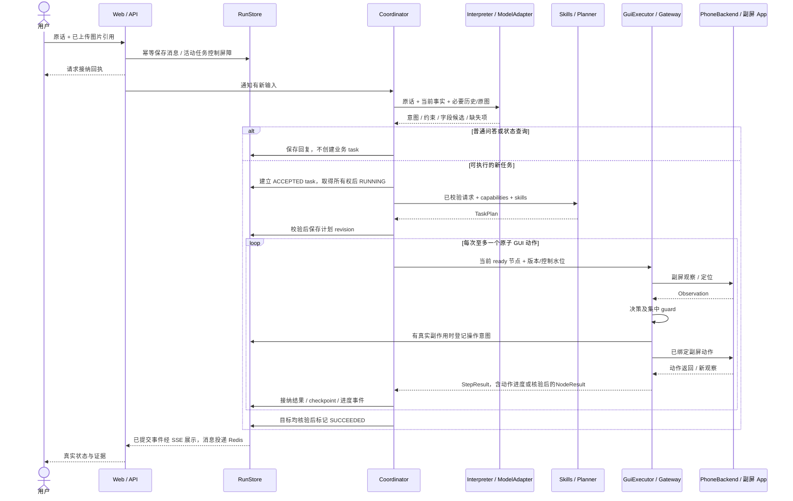
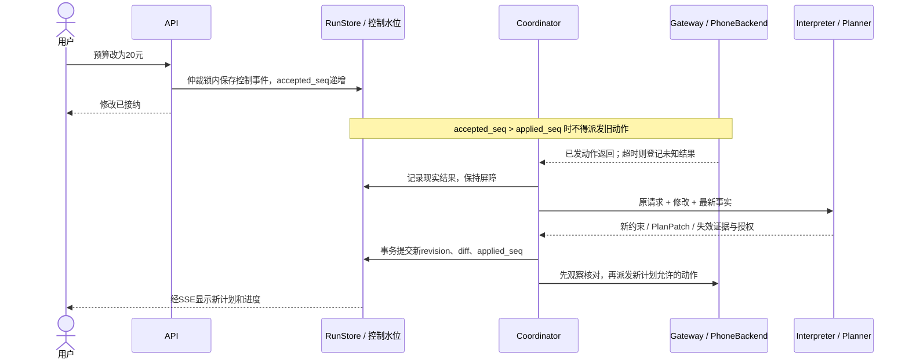
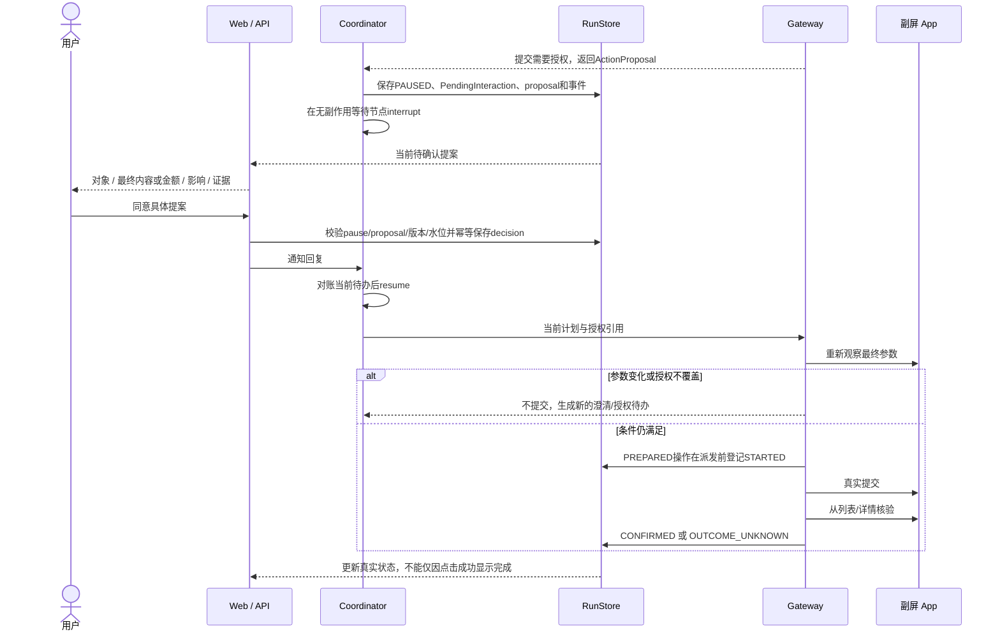
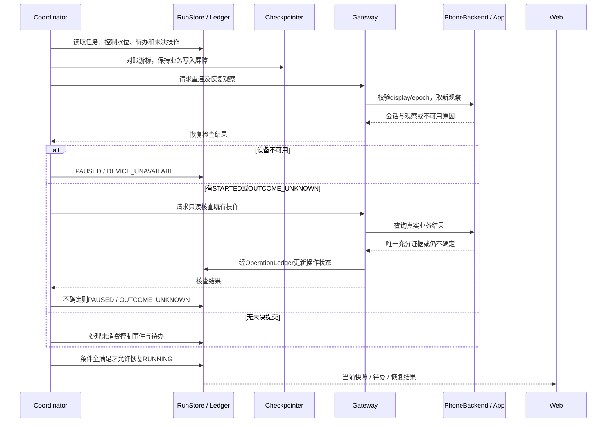

# Wellphone 状态流转、执行时序与用户交接

日期：2026-09-21。状态：**MVP 设计依据，尚未实现运行时。** 本文负责状态枚举、转移条件、事件顺序及人工交接；模块输入输出见[运行时契约](2026-09-21-agent-runtime-contracts.md)，系统边界见[主设计](2026-09-21-wellphone-design.md)，HTTP/SSE 与页面见[交互设计](2026-09-21-interaction-app-design.md)。修改状态或交接规则时，同步修改相关契约、调用方与有意义的测试。

## 1. 执行所有权与状态来源

一个 FastAPI 后端进程内只有一个 Coordinator，由 LangGraph 推进固定运行图；任务 DAG 是持久状态，三个业务不另建执行器。API 接纳请求，模型提出理解/计划/动作，Coordinator 接纳结果并修改任务；浏览器、模型和 Redis 都不能直接改任务状态。

| 对象 | 权威保存位置 | 谁写 / 何时写 |
| --- | --- | --- |
| 消息接收及任务关联 | SQLite RunStore | API 先存消息；Coordinator 判明新任务后建立 task，普通问答/状态查询不创建业务 task |
| 目标、DAG 版本、节点结果、任务状态 | RunStore | Coordinator 在接纳理解/计划/执行结果时写 |
| 控制水位及待处理事件 | RunStore | API 在派发仲裁锁内接纳；Coordinator 消费并更新应用水位 |
| 用户待办、授权和操作账本 | RunStore / OperationLedger | Coordinator 保存交接/授权；Gateway 在真实副作用派发前后登记操作 |
| LangGraph 游标和 interrupt | SQLite checkpointer | 运行图在步骤边界保存；恢复时服从 RunStore，不覆盖更新的事实 |
| 对话历史 | Redis | 已提交消息按稳定 ID 投递；临时未同步不改变任务事实 |
| 图片/观察/结果证据 | ArtifactStore | API 保存输入图，PhoneBackend 保存副屏观察；文件引用关联请求或操作 |
| 页面进度 | 浏览器展示缓存 | 从一致的状态快照和已提交 SSE 事件更新，无独立执行权限 |

接纳“暂停/修改/取消”和派发下一动作使用同一进程内仲裁锁。未消费控制事件、暂停、无效设备连接或未决提交会阻止新的业务动作；必要的结果观察仍允许。MVP 不引入分布式锁、租约服务或第二套任务队列。

## 2. 任务状态机

`TaskStatus` 只有下列七种；`phase` 表示当前理解、规划、执行或核验阶段，不把每个 LangGraph 节点都扩成一种任务状态。

| 状态 | 进入条件 | 允许的后续 |
| --- | --- | --- |
| `ACCEPTED` | 已判明新任务并持久关联原请求，尚未开始执行 | 获得唯一执行所有权后 RUNNING；用户暂停后 PAUSED；取消后 CANCELLED |
| `RUNNING` | 开始理解补充、规划、GUI 执行或核验 | 需要等待时 PAUSED；证据充分时 SUCCEEDED/PARTIAL；明确失败时 FAILED；停止后 CANCELLED |
| `PAUSED` | 有明确暂停原因和继续条件，已停止新业务动作 | 条件满足并完成恢复检查后 RUNNING；用户取消后 CANCELLED；确认无法继续后 FAILED/PARTIAL |
| `SUCCEEDED` | 全部请求目标有实际核验依据 | 终态；新的修改请求建立关联的新任务 |
| `PARTIAL` | 任务结束且只有一部分目标经核验完成 | 终态；列明未完成项及真实副作用 |
| `FAILED` | 无法完成目标且已结束尝试，不是单纯等待用户 | 终态；保留原因和已发生的真实操作 |
| `CANCELLED` | 用户取消，停止后续派发并盘点在途操作 | 终态；未决副作用仍保留核查屏障，不等于撤销订单/退款 |

`PAUSED` 携带 `pause_id`、`pause_reason`、当前待办和继续条件。原因只保留六类：`CLARIFICATION`（缺信息）、`AUTHORIZATION`（缺授权）、`USER_TAKEOVER`（需要人工操作）、`USER_PAUSE`（用户主动暂停）、`DEVICE_UNAVAILABLE`（设备/显示或目标 App 持续不可用）、`OUTCOME_UNKNOWN`（真实提交结果未明）。结果未知不是 FAILED，等待用户也不因超时自动变成同意或执行。

收到停止请求时先返回“请求已接纳”；如果已有动作在途，先处理它的结果，再显示“已暂停/已取消”。这一短暂过程使用控制水位差展示，不额外引入一套重复状态机。普通用户回复可以直接解除对应澄清/授权等待，不要求再点一次通用“继续”。主动暂停或人工处理完成则发送匹配 `pause_id + expected_control_seq` 的继续事件。

## 3. DAG 节点与真实操作是两种状态

节点仍沿用运行时契约：`PENDING → READY → RUNNING → SUCCEEDED` 为正常路径；`WAITING` 表示需要外部输入，`BLOCKED` 表示依赖未满足/能力受阻，另有 `FAILED/CANCELLED/OUTCOME_UNKNOWN`。WAITING 条件解除后回 READY；BLOCKED 只有依赖或能力变化才回 READY。节点内多次观察/点击不反复生成新节点，后继只在前驱结果被核验接纳后 READY。

用户修改使已完成事实不再满足新目标时，保留旧结果并增加/替换新 revision 的工作项；不把已创建会议改写为“从未创建”。新业务操作需要新的目标节点或显式修正节点。

本地 `operation_id` 只帮助对账，不能给第三方 GUI 创造幂等性。未知结果不盲重试，不通过取消再建任务绕过。MVP 不自动重试真实业务提交，FAILED 是终态；有证据确认未生效后，新的明确用户请求才可重新准备并关联原失败操作，具体见运行时契约第 7 节。只保存足以完成本任务恢复的账本与证据，不建立通用补偿事务引擎。

## 4. 什么时候交给用户

| 情况 / 触发者 | 自动执行到哪里 | 向用户提供什么 | 恢复条件 |
| --- | --- | --- | --- |
| 日期、对象、地址、金额范围缺失或互相冲突；Interpreter/Planner 提出 | 已有足够依据的只读分析完成，依赖缺失字段的业务动作暂停 | `CLARIFICATION`：具体缺哪个字段、候选、为什么影响结果；尽量一轮问清相关槽位 | 回复能确定目标与约束；重新理解并视影响 replan |
| 邮件/消息外发、订单提交、付款等缺少覆盖最终参数的授权；Gateway 判定 | 收集资料、形成草稿/最终核对页，停在不可逆提交前 | `AUTHORIZATION`：可审阅的最终对象、内容/附件、商家/商品/总额/收款对象、影响及证据 | 明确同意该提案，参数仍一致且授权有效；否则保持暂停或修改 |
| 验证码、密码、生物认证、必须人工处理的页面；PhoneBackend/执行器报告 | 停止自动输入和提交，保留已知进度 | `USER_TAKEOVER`：需要人工做的具体一步、入口、完成后怎样继续；不要求在聊天填写密码/验证码 | 用户报告完成，重新观察并核对实际结果，再放行 |
| 用户说暂停、停止、修改；API 接纳 | 立即阻断新动作，已派发动作结束后记录结果 | 接纳回执、是否仍有在途操作、已完成事实；修改展示新旧计划差异 | 主动暂停需继续；修改经新计划校验后继续；取消终结后续执行 |
| 设备断开、副屏无效、目标 App 在有限恢复后仍不可用、用户转到同包 App；Backend/Gateway 判定 | 停止设备写入，不降级主屏 | `DEVICE_UNAVAILABLE`：原因及最小处理方式 | 设备/App 恢复或冲突解除，建立有效会话并取新观察；恢复规则与额度见运行时契约 4.1 |
| 下单/发送/保存后超时；Gateway/核验结果发现 | 先尝试有限的只读核查；无法确定就停止提交 | `OUTCOME_UNKNOWN`：已尝试什么、目前证据、需要用户核查什么 | 唯一充分证据消除未知；“没看到”或一句“再试试”不自动证明未生效 |

**已有授权的复用：**用户已明确授权具体收件人、最终正文和附件，或明确授权某收款对象与金额，且仍有效时，无须机械重复确认。初始“帮我写封邮件”只覆盖草稿；“点份 30 元以内的午饭”不能被默认解释为任意支付授权。最终金额、对象、地址或内容变化超出授权范围时重新提案。下单与付款分别判断，不把批准下单当成允许扣款。

会议/日历的标题、时间等已明确且用户要求创建时，可在授权范围内保存；发邀请、分享或支付是另外的影响。邮件在此用于说明授权规则，**不因此新增邮件工具或第四个演示业务**。

MVP 用固定影响枚举、已测 AppProfile 和一个集中判断入口即可；模型/skill 可以提出需要交接，但不能自己生成“用户已授权”。不做通用风控系统、多级审批、组织权限或策略语言。

### 4.1 最小人工待办结构

复用运行时契约的 `PendingInteraction`：`pause_id, task_id, status, reason, prompt, expected_response, plan_revision, accepted_control_seq, source_refs, proposal_id?`。`status` 只需 `OPEN/RESOLVED/SUPERSEDED`，`expected_response` 描述字段/候选或 `decision/done` 类型；一项任务只展示一个当前阻塞待办，保存旧待办用于追溯。回复绑定对应 `pause_id`、预期计划版本和控制水位；授权还绑定 proposal、operation 和参数 hash。过期回复不套用到新待办，同 ID 重复回复不重复派发。授权精确参数和有效范围仍复用 ActionProposal，不再复制一套审批数据模型。

Coordinator 先把暂停原因、待办和 SSE 事件落库，核对 Gateway 已登记的操作状态，再进入独立的 LangGraph interrupt 节点；节点内没有真实提交副作用。用户回复也先持久接纳，再经同一 run owner 使用 `Command(resume=...)`。如果持久待办已存在而 checkpoint 尚未到 interrupt，恢复时先对账并到达等待节点；不把 resume 发给一个根本没有等待的旧图。

### 4.2 人工接管怎样不抢主屏

澄清和授权均在 Web 工作台中展示，不向 Android 主屏弹框、不强制打开主屏 App。等待期间 Agent 不继续该任务的业务写入。

MVP 不做网页远程控制器。需要验证码/登录/支付认证时暂停，说明须进入一次用户知情的准备/维护窗口；必要时结束本次并发演示，由用户在模拟器窗口处理，再恢复。不会自动把副屏 App 搬到主屏，也不启动第二条抢焦点的控制通道。若某业务必须持续人工完成，则记录实际自动完成范围，不能称为无打扰全自动通过。

## 5. 时序：新请求与正常完成

图中存储箭头代表进程内适配器调用，不是另建网络服务。截图字段提取按需由 Interpreter 调 ModelAdapter/VLM 完成，结果校验后才进入规划；普通 GUI 判断由 GuiExecutor 使用树或副屏图。循环受节点步骤/时间预算及自动 replan 上限约束，必要暂停按第 4 节处理；只有完成条件均有证据才能退出为成功。

## 6. 时序：执行中修改与 replan

旧模型返回值即使先完成，也须检查控制水位和版本；不能抢在新计划生成前偷偷派发。修改请求若仍缺关键条件，转为 CLARIFICATION；若在途提交未知，先解决 OUTCOME_UNKNOWN，不靠 replan 消掉账本。

## 7. 时序：具体授权与继续

## 8. 时序：重启 / 设备断连恢复

下面描述设备可重新连接后的运行时恢复；整机进程已崩溃时，先按[运行时契约 4.2](2026-09-21-agent-runtime-contracts.md#42-开发期的崩溃取证与受控重启)保存日志、初判并在已授权调试窗口恢复 AVD。运行时保持 PAUSED 和业务写入屏障，环境重启成功本身不将任务改为 RUNNING。开发恢复可继续进行，已中断的并发演示须另起一轮，不能记作无干扰通过。

恢复沿用 RunStore 中的剩余重试预算，不能因进程重启或图恢复获得新额度。首版只需这一条恢复路径，不做任意时间回溯、自动退款/撤销、无限重试、跨任务补偿或多实例故障转移。正常路径与本页列出的中断分支是必要测试范围；不为假想组合堆积完整异常矩阵。
