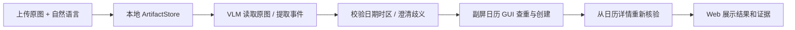
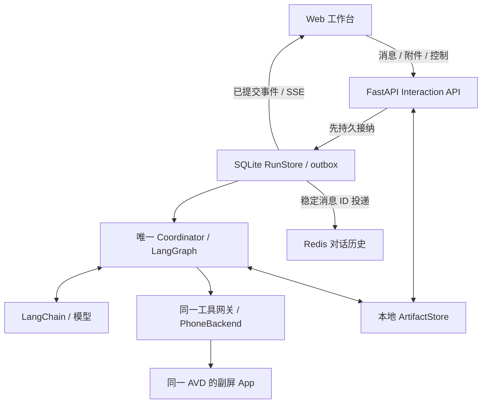

# Wellphone 交互应用与开发入口

日期：2026-09-21。状态：**MVP 交互设计基线；尚未实现 Web 应用或通用 Agent。** 用户已反馈美团和腾讯会议登录成功，并要求上传截图、输入自然语言的交互应用。本文件只定义新增交互层；执行语义继续以[运行时契约](2026-09-21-agent-runtime-contracts.md)为准。

本文作为交互层开发依据；客户端形态按 Web MVP 设计，尚无运行结果。模块数据见运行时契约，状态/时序与交接条件统一见[执行流程](2026-09-21-execution-flows.md)，不在前端复制业务判断。

## 1. 推荐形态与取舍

推荐先做 **React + TypeScript + Vite 的响应式 Web 应用，Python FastAPI 提供同源接口，SSE 推送任务事件**。演示时在电脑打开，用户继续操作 Android 主屏；手机浏览器的布局可以适配，但远程访问和原生 APK 不属于首版部署承诺。

| 选择 | 优点 | 代价 / 本次决定 |
| --- | --- | --- |
| React Web + FastAPI | 图片上传、对话、计划、修改与确认可组织在同一界面；复用 Python 运行时 | 需要少量前端工程，推荐 |
| Gradio / Streamlit | 适合快速模型验证和临时内部界面 | 长任务事件、刷新恢复和精确动作确认仍需专门接线，不作为最终 MVP 入口 |
| Android 原生 App | 可以直接装在手机上发起任务 | 增加 APK、文件权限与网络连接工作；并不解决副屏驱动难题，暂缓 |

本轮以 Web 作为满足上传/对话需求的 MVP 选择，并非把用户的“app”一词解释成必须原生或必须 Web；若明确需要原生安装再调整此边界。既有 LangGraph、LangChain、Redis、SQLite 和 GUI 工具选择不变。

## 2. 用户能做什么

首版一个工作台，不为三个业务分别写页面或工作流：

- **对话和附件：**输入自然语言，选择、拖入或粘贴图片；发送前预览、移除附件。支持 PNG/JPEG，每张最多 10 MiB、解码后最多 2000 万像素，每条消息最多 3 张；失败说明具体原因，上传成功不等于任务已经开始。
- **任务进度：**展示目标、关键约束、步骤依赖和当前步骤。DAG 可查看，首版不做拖拽编辑器；通过自然语言修改目标，由同一规划器生成 diff。
- **控制：**暂停、继续、取消；也接受“预算改为 20 元”等自然语言。显示“暂停请求已接纳”和“已暂停”的区别。
- **必要确认：**已有指令足够明确时继续执行；仅在缺少条件或授权时展示具体的时间、金额、对象、地址摘要等提案，不要求逐次点击确认。
- **结果：**展示实际完成范围及从 App 核验的证据。外卖“已选餐”“待提交”“已下单”“已支付”分别呈现，结果未知时明确等待核查。

桌面版采用对话区与任务详情区；窄屏按“对话 / 任务”切换。副屏最新画面放在可展开的只读证据区，MVP 不做低延迟视频播放器、浏览器遥控或主屏采集。运行期间不主动聚焦浏览器、弹系统通知或发出声音。

### 2.1 等待用户时的三个入口

都展示当前 `PendingInteraction`，仅处理与当前 `pause_id` 对应的回复；旧卡片显示已处理/已被新请求替代，不能继续点旧按钮。暂停原因由后端提供，浏览器不自行判断风险。

| 卡片 | 展示与用户操作 | 后端继续条件 |
| --- | --- | --- |
| 需要补充信息 | 明确缺什么，展示候选或输入框，例如会议日期；提交一条关联待办的消息 | 理解并校验字段，有歧义继续问，必要时 replan |
| 确认具体操作 | 展示最终对象/内容/金额和证据；同意、拒绝，或通过消息修改 | 授权绑定具体 proposal，参数仍被覆盖；拒绝不执行，可修改或取消任务 |
| 需要亲自处理 | 说明登录/验证码/支付认证的具体步骤，以及如何在准备窗口处理；按钮“已处理，继续检查” | 恢复后重新观察实际状态；点击按钮本身不证明登录/支付成功 |

主动暂停、设备不可用和提交结果未知显示各自原因与恢复条件；未知结果先核查，不显示诱导重复提交的“重试付款”按钮。人工处理可能需要中止本次并发演示，界面如实说明；不自动把目标 App 拉到主屏。已有有效具体授权时直接继续，普通导航不逐步确认。邮件只作为授权语义示例，不新增邮件演示页面。

## 3. 上传截图到日历：明确调整资料入口

此前主设计把“从副屏图库打开手机内图片”设为默认资料路径。新增上传需求后，MVP 默认改为：

该调整的理由是：用户已明确提供任务材料，直接读原图能保留分辨率，省去导入图库、选择查看器和二次截屏。**这是主动变更资料来源，不是声称已经从手机读取了上传文件。** 上传原图标记 `source=user_upload`；结果截图标记 `source=secondary_display_observation`，两者分别保存来源。

不用业务 API 的约束继续适用：VLM 只理解用户提供的材料；创建、查询和核验日历依然在真实 App 中完成。不使用 Calendar Provider、会议 API 或外卖接口。首版仍不引入独立 OCR。

“整理手机图库里已有图片”保留为另一个可选输入场景，需图库/查看器通过副屏预检后才启用。没有通过时如实显示不支持，不将上传路径包装为图库读取能力。本轮按用户需求将上传路径列为设计基线；新增入口仍需实现和验收。

## 4. 与运行时接线

FastAPI 和 Coordinator 在同一后端进程中。运行时由应用生命周期启动、从持久请求恢复，不能依赖一次 HTTP 请求或 `BackgroundTasks` 的存活维持任务。浏览器只保留展示状态；关闭网页、刷新或 SSE 断开不取消任务，服务重启则按已有账本恢复规则处理。

SQLite 是执行事实来源，Redis 是消息历史查询层。前端不持有第二份可写 DAG，不直接调用 Appium、ADB 或模型，不接收 `.env` 密钥。后端首版绑定 `127.0.0.1`；本机同源会话和写请求来源校验在接入层处理，不为无认证局域网暴露提供快捷开关。后续手机访问需要另行定义可信接入，但无需为此先做多租户。

## 5. 最小接口和持久化规则

下表为拟定接口，尚无可调用服务；统一前缀 `/api`。

| 接口 | 行为 |
| --- | --- |
| `POST /conversations` | 创建对话，actor 由服务端固定 |
| `POST /artifacts` | 接收图片；实际解码校验后保存不可变文件，返回 `artifact_id`、摘要、尺寸和类型 |
| `POST /conversations/{id}/messages` | 接收 `client_message_id,text,artifact_ids,target_task_id?`；回复待办还带 `reply_to_pause_id,expected_plan_revision,expected_control_seq`，持久接纳后返回 receipt |
| `GET /conversations/{id}` | 返回消息投递状态、活动任务、当前 DAG/待回复项及快照事件水位 |
| `POST /tasks/{id}/controls` | 接收 `event_id,expected_plan_revision,type`；继续还需 `expected_control_seq,pause_id`，其余按运行时控制协议处理 |
| `POST /tasks/{id}/decisions` | 接收 `event_id,decision,pause_id,expected_plan_revision,expected_control_seq,proposal_id,operation_id,canonical_args_hash`，确认/拒绝当前具体提案 |
| `GET /conversations/{id}/events` | SSE；支持初次游标和重连 `Last-Event-ID` |
| `GET /artifacts/{id}` | 经同源会话读取本任务的材料/证据，不接受任意文件路径或远端 URL |

同一个 `client_message_id/event_id` 重复发送返回原 receipt；同 ID 不同内容拒绝。上传本身不触发设备操作，发送消息时才把不可变附件引用绑定请求。文件名由服务端生成，限制流式上传字节数与图片解码资源，不把扩展名当作文件类型判断。文件内容留本地，Redis 和 checkpoint 只存引用；调用 VLM 时解析为实际图片载荷，不能只传路径。

接入层将关联待办的消息、decision 或“已处理”继续事件归一为契约中的 `UserResponse`。`reply_to_pause_id` 映射 `pause_id`；版本/水位在接纳回复的仲裁锁内核对，再生成新事件水位，不能把本次递增误判为回复过期。自然语言“同意”只有明确指向当前展示提案才可作为授权候选，否则澄清。无关聊天不自动解除暂停。

未完成、暂停或结果未知的任务引用的原图必须保持可读，不按普通缓存期限删除；恢复时核对文件及内容摘要，缺失或损坏则明确受阻并请求重新提供，不能凭历史摘要继续创建。

消息接纳后由 RequestInterpreter 判定新任务、修改、查询或补充信息；对活动任务的未判明新指令先进入控制接纳路径，阻止旧模型结果继续派发。明确的状态查询不改变控制水位。暂停按钮无需等 LLM 识别意图，直接提交控制事件。首版一个活动任务；独立新任务若与其冲突，返回忙碌/澄清，不静默启动第二个执行器，也不把“取消旧任务”解释为撤销已发生业务。

继续只能解除客户端实际看到的那次暂停：服务端在仲裁锁内同时校验当前 `pause_id`、控制水位和计划版本，拒绝旧标签页或延迟请求解除新暂停。对同一未终结任务的暂停/取消，旧计划版本不丢弃用户的停止意图；接纳为当前任务控制事件并返回当前水位，不影响其他 task。具体规则也适用于自然语言转成的控制事件。

SSE 从 SQLite 已提交的 outbox 派生，按 conversation 分配单调 `event_seq`，携带 `task_id,plan_revision,type,payload`。初次 GET 的执行快照与事件水位来自同一 SQLite 读事务；Redis 历史不是同一事务，按稳定 message ID 与 pending delivery 合并并显示同步状态。SSE 按至少一次投递设计，前端按 ID 去重；丢失/过期游标重新取快照，不能漏掉修改后状态。

快照包含 `accepted_control_seq,applied_control_seq,pending_interaction`；暂停/控制事件 payload 携带同样的当前水位和暂停标识，使刷新后的回复/继续按钮有明确基准。正在停止时展示接纳进度；只有后端已应用事件才显示已暂停。

确认按钮针对展示的具体提案。关键参数变化后旧提案失效，由后端再次校验；无关 replan 时按既有规则验证授权覆盖关系。前端禁用按钮不是授权守卫；点击“开始”也不代表任意支付许可。收到暂停后已发出的动作仍需核查结果，UI 不承诺即时撤回。

## 6. 下一阶段的实施顺序

1. **环境与页面验证继续推进。** 当前已升级 4 核/6 GiB/host，但美团仍有原生崩溃/ANR，详见[准备报告](../../validation/2026-09-21-real-app-preparation.md#33-用户要求升级资源4-核--6-gib-与新的失败证据)；先查兼容问题，再在短暂无人操作窗口检查已可稳定运行 App 的副屏启动、树、中文字段和跳转，真人并发输入另约时间。登录成功只是账号准备完成。
2. **交互层可按本设计独立开发。** 上传、消息持久接纳、状态查询、控制 receipt 与 SSE 重连可以用明确标注的测试运行时验证。真实设备未就绪时界面显示不可执行，不能模拟“已完成”。不必等所有 App 都通过才做前端。
3. **优先打通一条真实闭环。** 副屏隔离及至少一项必要业务路径通过后，接 LangGraph/LangChain、模型能力探测、版本化 DAG 和工具网关；先选已通过页面验证的日历或会议。
4. **扩展任务与恢复。** 增加其余业务 skills、运行中修改、暂停与未知结果恢复；外卖路径单独验收，性能或输入不通过就明确该 App 的阻碍。

这是工作顺序，不是承诺几小时解决所有 App 兼容问题。三个业务共享一套运行时，页面不兼容不通过增加业务 workflow 掩盖。

## 7. 交互验收

- 上传 PNG/JPEG 后有预览；超限、损坏、解码超限文件有明确反馈；移除未发送附件不改变已发送请求。只上传不执行。
- 同一消息双击发送或断网重试，只产生一份请求和任务；同 ID 不同内容冲突可见。
- 前端显示真实 DAG、当前 revision 和动作证据；刷新/SSE 重连恢复状态，无重复派发。
- 模型思考或 GUI 动作在途时修改请求：旧结果不能继续执行，UI 展示已接纳、实际应用版本与 diff。
- 暂停/取消立即进入持久控制路径；请求已接纳、已暂停和结果未知均能区分。
- 关键金额、对象或时间变更后旧确认不能提交；已有明确授权不重复弹框。
- 上传原图的 VLM 识别有字段和来源证据，真实日历从列表重新打开核验；不把模型输出当成创建成功。
- 浏览器断开、Redis 暂不可用、服务恢复均遵循唯一 RunStore；任务状态不由聊天文本推断。

新增交互验收补充[整体验证计划](../../validation/2026-09-21-feasibility-and-demo.md)，不能替代 G1–G3 副屏隔离、真人输入及真实页面验收。
