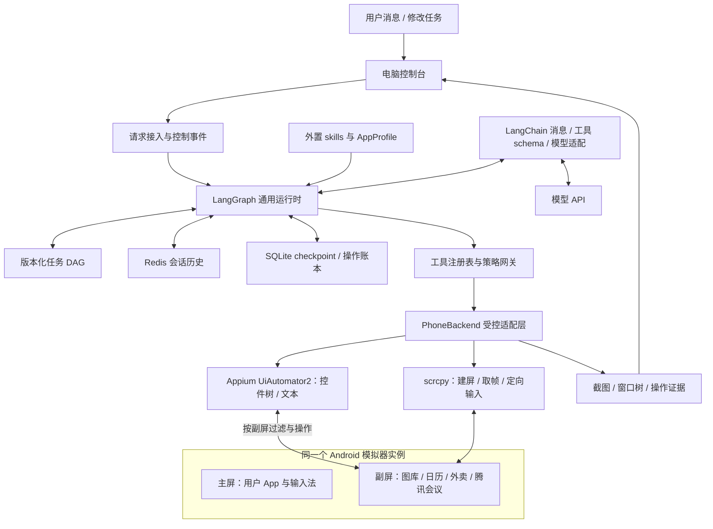
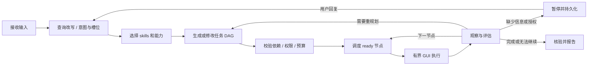
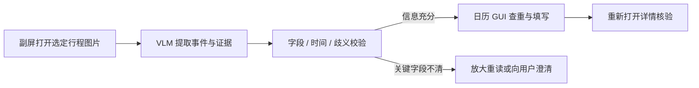

# Wellphone V2：主屏给用户，副屏给通用 GUI Agent

日期：2026-09-21。状态：**通用 Agent 尚未实现；已通过同一 API 34 AVD 的原生控件/合成 IME 并发机制实验，真人输入、模型和真实 App 尚未验收。** 结果、限制与失败记录见[实测报告](../../validation/2026-09-21-appium-concurrency-probe.md)。

本版取代首版“系统数据接口优先”的选型。用户已确认：主要在单个 Android 模拟器开发和演示，真机可选；已有外卖账号、地址和腾讯会议账号；不接业务 API，希望 Agent 通过副屏与真实 App 交互。

## 1. 总体决策

构建一个通用运行时：**LangGraph 编排 + LangChain 消息和模型适配 + 动态任务 DAG + 外置 skills + 受控副屏工具**。日历、外卖、腾讯会议共享同一规划器、执行器、观察器和验证机制；领域知识放在外部 skill 文件中，不为每个业务写一张 LangGraph workflow。

这是有官方机制依据的候选主线，尚未通过具体 App 可行性门槛。实现顺序先做无需 LLM 的页面兼容预检与最小中文/焦点探针；通过后才投入 LangGraph、Redis、DAG 和业务 skills。前置实验的范围与停止条件见[验证计划](../../validation/2026-09-21-feasibility-and-demo.md)，不能等完整业务实现后才验证底座。

同一个 Android 实例提供两块显示区域：主屏由用户操作；Agent 的目标 App 在虚拟副屏运行。所有截图、窗口树、触摸、滑动、填写和返回操作绑定副屏，模型没有主屏操作工具。

“不用 API”的范围是：不调用外卖、腾讯会议或系统日历的数据接口代办业务。仍使用已配置的模型 API；ADB、scrcpy、Android 无障碍是手机控制实现所需的系统接口。日历新增也通过真实 App 界面完成，旧版 ContentProvider 业务桥退出首版。

开发和演示以一个官方 AVD 为目标，首轮预检固定 API 34，以对应已追踪的 Android 14 源码；API 35 属后续单独验证版本。两个独立模拟器不能证明同机并发。没有真机也推进模拟器验证版，提交时说明原题的物理手机部署项尚未覆盖。

| 路线 | 优势 | 代价 | 决定 |
| --- | --- | --- | --- |
| 通用副屏 GUI Agent | 使用真实 App、现有账号；工具可组合成新任务 | 焦点、中文输入、App 跳屏与结果核验须实测 | 本版主线 |
| 业务 API / 系统数据接口 | 结构化、通常稳定 | 开放权限有限，不能自然覆盖各类 App | 不接；保留研究作为取舍依据 |
| 每任务固定业务 workflow | 固定示例容易演示 | 新需求和中途修改需不断改代码 | 不采用 |

## 2. 架构

控制台展示计划 DAG、节点进度、修改差异、动作轨迹和证据。副屏画面可在电脑上被动预览，Android 主屏保持用户自己的界面；控制台不自动激活宿主机窗口。

## 3. 固定运行引擎，动态业务 DAG

LangGraph StateGraph 是固定且允许循环的运行引擎。每次任务的 `TaskPlan` 是 state 中按 revision 保存的无环依赖图，不在执行中反复修改已编译 StateGraph 的拓扑。

DAG 节点表达“筛选符合条件的菜品”“填写并创建会议”等目标。节点内部运行有限循环：`观察 → 决策 → guard → 操作 → 再观察`。每次 tap 都可审阅，但不为每次点击重规划整个业务 DAG。定位失败先有限恢复；目标、约束、依赖或可达性变化才 replan。

通用 LangGraph 引擎按原子 GUI 步骤返回并持久化游标/checkpoint，不把整段点击循环包进一个只能从头重跑的大节点。每步保存执行状态不等于每步重新规划业务 DAG。

`Send` 可以把运行时工作项分发给已注册 worker；依赖校验、ready 计算、资源占用和结果合并由本项目实现。MVP 顺序执行 ready 节点，同一设备的观察和动作串行；只保留独立离线分析的未来并行接口。

## 4. 查询改写、意图识别与上下文

理解节点输出原话、规范化请求、意图、槽位、约束、引用来源、缺失信息及目标 task ID。改写和意图识别可以合并为一次结构化模型调用；明确的停止、确认、状态查询可先规则处理。

| 输入 | 处理 |
| --- | --- |
| “帮我点份午饭，30 元内，别辣” | 新任务；保留预算与忌辣，核实是否含配送费等缺失条件 |
| “就刚才那家，换成不带花生的” | 从当前任务解析商家引用，产生修改事件 |
| “会议改到三点” | 确定目标会议与日期；多个候选则澄清，不猜对象 |
| “现在到哪了？” | 读取状态，不重新执行业务计划 |
| “别下单了” | 停止新提交，核对已经发生的副作用 |

改写不得丢掉否定条件、金额、数量、时间和时区，不得把“比较一下”扩大为“下单”。历史摘要只用于理解，任务约束和授权另行持久化。需要澄清时通过电脑对话，不向 Android 主屏弹框。

**运行中持续维护结构化状态。** 每次理解输入同时读取当前目标、约束、DAG 版本、已完成事实、待回答问题和设备会话；不只把整段聊天重新交给模型猜测进度。`conversation_id` 标识对话，`task_id` 标识任务，`session_id/session_epoch` 标识副屏连接，三者分开。活动任务关联和用户修改先落 RunStore；Redis 保存可查询的消息历史。字段与唯一事实来源见[运行时状态契约](2026-09-21-agent-runtime-contracts.md#21-持续维护的运行状态)。

## 5. DAG、修改任务和 replan

每份计划包含 `task_id`、`request_revision`、`plan_revision`、目标、约束、skill 版本和节点。节点声明依赖、输入引用、目标、允许工具、资源、成功条件和预算。完整 schema 见[运行时契约](2026-09-21-agent-runtime-contracts.md)。

外卖实例计划：

只要求推荐时，计划在候选比较后结束；只要求加购时，在购物车核验后结束；要求下单才包含提交节点。技能不强制所有请求走完整链条。

中途预算从 30 改成 20 元：接入层记录控制事件，停止派发新动作；当前已发出的 GUI 动作结束后持久化结果。规划器保留仍有效的地址/商家观察，失效受影响的候选、核价和授权，生成新 revision 与 diff；校验后调整本任务购物车，再执行新计划。

已经下单时不能把状态改回“尚未下单”。先查真实订单状态，再决定是否需要新的取消/退款任务。计划删除不撤销现实副作用。

coordinator 唯一修改计划；旧 revision 的模型结果和 worker 回报先进入审计，未经显式接纳不能覆盖新计划。接收修改后立即设持久控制事件屏障，即使新计划尚未生成，也禁止派发旧动作。修改在原子动作间生效，不承诺撤回已经发出的点击。

## 6. 通用工具与审阅机制

注册表声明工具 schema、影响类型、前置条件、资源、预算、证据要求和恢复策略。模型只看到当前节点的允许工具子集。

| 类别 | 工具示例 | 边界 |
| --- | --- | --- |
| 会话 | `phone.session.open/status/close` | 绑定副屏；模型不能自行选择主屏或其他设备 |
| 观察 | `phone.observe` | 副屏截图与该 display 的窗口树 |
| 导航 | `phone.launch_app`、`phone.back` | 已审核包名和页面转移；禁止全局 Home / monkey |
| 交互 | `phone.tap/swipe/set_text/key` | 指定 observation 与目标；中文填入通过实验后启用 |
| 等待 | `phone.wait_for` | 等待可观察条件，有超时和取消点 |
| 资料 | `artifact.read`、`evidence.record` | 本任务材料；无任意文件或 shell 访问 |
| 计划 | `plan.propose_patch` | 提交建议，由校验器接纳 |

每步记录所用观察、目标 App/display、参数、授权依据、前后证据及结果。常规导航在已有任务授权内连续进行；关键金额、地址、商品、对象变化时重新核对授权，不要求每个 tap 都让人确认。

通用点击也可能购买或发送，因此影响级别不能只相信模型自报。`AppProfile` 描述包名/版本、已测页面、已知提交入口、允许转移和结果核验方式。无法判断影响的动作不能自动归类为无害导航；skill 无法绕过网关。

首版不提供任意 shell/HTTP、主屏截图、全局输入/剪贴板、切换 IME 等工具。

## 7. 外置 skills 与 AppProfile

产品 skills 放在 `skills/`，与开发用 `.agents/skills/` 区分。Markdown 包含适用范围、必要能力、操作知识、成功证据和失败处理；可附少量同目录资料。运行时固定 skill 的版本/哈希，只加载相关内容。

首批为 `itinerary-to-calendar`、`food-ordering`、`tencent-meeting`。它们描述时间解释、费用/禁忌、会议规则等知识，不存固定坐标、不直接执行 shell、不成为三套独立调度器。规划器按用户目标和当前页面决定步骤。

从成功轨迹提炼经验只能生成待审阅草稿，不能自动变成可信技能或新增权限。AppProfile 中少量 App 专属控制规则仍有必要；新增 App 要验证安装登录、副屏、文本及提交入口，不能只放一份 Markdown 就声称全面兼容。

## 8. 副屏实现及硬性边界

候选底座为 scrcpy v4.1 + Android 14 AVD，shell 身份运行 server，副屏使用 `PUBLIC + TRUSTED + OWN_FOCUS + STEAL_TOP_FOCUS_DISABLED`。禁抢 top focus 的 VirtualDisplay flag 为 `1 << 16`；本轮已构建该单项补丁，并在指定 AVD 读取数值 flags 验证生效。原生控件机制通过不代表完整控制通道或真实 App 已验收；不同时扩展镜像兼容矩阵。

“隐藏”指不占 Android 主屏，并非使用 `PRIVATE` display flag；AOSP 无障碍可能排除非系统持有的 PRIVATE 虚拟屏。电脑可以保留副屏预览。

**优先复用 Appium UiAutomator2，不默认自写完整 Accessibility 桥。** 已核验的新版 driver/server 提供 `currentDisplayId`、按屏节点查找和 Unicode SET_TEXT；设置 `enableMultiWindows=true` 后，在 Android 设备端取目标 display 的窗口根，再序列化 XML。不能沿用默认 `getRootInActiveWindow()` 路径。具体版本、默认行为与源码见[自动化框架复用研究](../../research/2026-09-21-agent-runtime-and-gui-research.md#7-复用手机自动化框架与-mcp)。

| 职责 | MVP 选择 | 本项目补充 |
| --- | --- | --- |
| 虚拟副屏、连续取帧 | scrcpy | 禁抢 top focus 的 flag 与会话绑定 |
| UI 树、元素语义定位、中文填写 | Appium UiAutomator2 | 固定副屏设置、设备端范围校验、禁全局 Toast、无隐式 Enter 的 SET_TEXT |
| 点击、滑动、Back/Enter | scrcpy 定向控制通道 | 从已验证 observation 转换坐标；失败即拒绝，不使用全局 Appium key/Back |
| 定向启动 App | Appium `mobile:startActivity` 的 display 参数 | 可信适配器构造参数，先检查已有 task；不开放任意 Intent |
| 任务授权、动作审阅、证据与恢复 | 本项目 Gateway / Coordinator | 复用同一 `phone.*` 接口；驱动不决定业务权限 |

Appium 是设备自动化驱动，MCP 是向 Agent 暴露工具的协议，两者不替代。首版 Python 运行时直接调用 Appium 客户端和 scrcpy 适配器即可；以后需要给其他 Agent 使用时，可在同一 Gateway 外加 MCP，不另造执行逻辑。现有 Mobile MCP、Maestro 和 Playwright Android 的默认通道不满足本项目副屏/主屏输入隔离，不能原样交给模型。

Appium 会话在准备期建立，自动启动/重置 App、自动解锁、切换 IME、全局 logcat 采集及无障碍服务抑制均需按[运行时契约](2026-09-21-agent-runtime-contracts.md#5-phonesessionobservation-与动作工具)约束。普通 `hideKeyboard=false` 也会触发 IME reset，应省略该 capability。全局 Toast 监听默认在 NewSession 启动，仅事后关闭设置还可能残留缓存；首版小补丁从启动时禁用其文本采集/日志/拼树。连接或 display 失效时关停工具，重绑并校验后才恢复，不能回落 display 0。

一个 Appium 会话操作副屏，用户正常操作主屏；不为两个 display 分别建立 UiAutomation 会话。设置 `waitForIdleTimeout=0`，避免把主屏持续输入当成副屏必须等待的全局忙碌状态；用副屏状态检查和文本读回来确认动作。设备端显示校验须读取刷新后节点的窗口，不能只依赖元素创建时缓存的 display ID。

这些是围绕成熟驱动的有限适配，不复制整个自动化框架。若底座探针发现无法以小范围修改满足隔离，先报告具体缺口再调整选型，不同时维护第二套自研驱动。

**中文填写的系统路径已明确，目标控件兼容须前置验证。** 本次核验的 Android 14 单 IME 不会随副屏变成两套；禁抢 top focus 的副屏无法显示 IME。标准可编辑 TextView 的 `ACTION_SET_TEXT` 可直接写中文。源码已追到显示上移、task 父容器排序和 IME 请求拒绝：正确 flags 下，副屏的普通焦点/输入请求不会因此切走主屏 IME。前提是主屏保持 top、不同 App/任务、支持该动作的控件且无额外跨屏行为，详见[研究 2.3](../../research/2026-09-21-agent-runtime-and-gui-research.md)。

预检重点是实际 AVD 与上述机制对应、真实 App 的原生/WebView/自绘控件是否支持填写、页面回调有无额外行为，以及持续中文组合输入时的实际结果。用最小固定动作探针完成，不等待 LLM/skills 实现。ASCII 可试定向 KeyEvents；不能把有明确限制的全局 IME/剪贴板方案作为失败时的透明替代。

| 风险 | 处理 |
| --- | --- |
| 主屏焦点、键盘或字符投递受影响 | 判实验失败并停止；事后恢复不能算通过 |
| 用户切到 Agent 正在用的同包 App | 停止新动作、用户优先；检测存在竞态，首版只承诺已测不同包场景 |
| 主屏后台已有目标包的旧 task | 启动前检查全部 task/activity；未验证独立启动能力则拒绝，不迁移或销毁用户已有任务 |
| 登录/支付/分享页回主屏 | 只用已测转移；一次跳屏即失败，监控不能证明预防成功 |
| 目标 App 触发主屏横幅、声音或振动 | 副屏不隔离这些全局效果，逐页验收；准备期明确通知设置，不在执行中静默改全局免打扰/音量 |
| WebView/自绘控件无可写中文节点 | 标记能力缺失；不借 ADB Keyboard 或全局剪贴板绕过 |
| 副屏重建 | session epoch 改变，拒绝旧动作，绝不降级到 display 0 |
| 安全窗口/验证码 | 暂停并说明；不绕过验证，不编造结果 |
| AVD 安装或登录失败 | 核查 ABI、镜像和版本；账号存在不等于兼容已通过 |

来源见[平台调研 R6–R12](../../research/2026-09-21-platform-research.md)与[本轮复核](../../research/2026-09-21-agent-runtime-and-gui-research.md)。

## 9. LangChain、Redis 和持久化

LangChain 提供消息类型、模型适配、结构化输出和工具 schema；LangGraph 负责唯一的执行编排，不再叠加另一套 AgentExecutor。

| 数据 | 首版实现 | 规则 |
| --- | --- | --- |
| 对话历史和摘要 | 普通 Redis + `ConversationHistoryStore` | 完整消息结构、稳定 message ID、幂等追加 |
| 执行 checkpoint | 文件型 `AsyncSqliteSaver` | 单进程单用户本地 MVP；不使用内存数据库 |
| 计划版本、控制事件、操作账本、历史投递 | 本地 SQLite | 保存事实与未知结果，不从聊天推断是否已下单 |
| 截图/窗口树/大结果 | 本地 artifacts | 持久历史只放引用和必要摘要；视觉调用临时加载实际图片；默认不入 Git |
| skills / AppProfile | Git 文件 | 受审阅、固定版本，不赋予额外权限 |

`langchain_redis.RedisChatMessageHistory` 和 RedisSaver 涉及 JSON/Search。为简化部署，先用基本 Redis 命令封装 history adapter，并复用 LangChain 完整 message 编解码；不引入向量库或长期语义记忆。

`conversation_id` 对应会话，checkpoint `thread_id = task_id`。MVP 一个会话最多一个活动任务，actor 固定本地用户；通过 `ActorContext` 与存储接口留扩展位置，不实现租户注册、配额或分布式调度。

`RuntimeState` 是由这些存储组成的执行视图，不新增第三份独立状态库。SQLite 保存目标/约束的权威版本、控制水位和真实操作结果；checkpoint 保存可对账的执行游标；Redis 的摘要不能覆盖这些事实。恢复顺序为：读取状态并盘点未决操作、阻断业务写入 → 对账修改与版本 → 重建并校验设备连接、重新观察 → 从 App 核查未决结果 → 满足继续条件后恢复；不从旧截图或旧提交按钮直接重放。

工具消息保留 `tool_call_id` 配对，裁剪按完整调用组进行。Redis 历史与图内 prompt 窗口分开，不每轮重载并重复追加。持久事件投影到 Redis，用 message ID 去重；Redis/SQLite 双写不原子，投递失败可重放，不影响对真实操作结果的判定。

## 10. 恢复、授权与真实完成

LangGraph interrupt 恢复会从节点开头重跑；checkpoint 不保证跨 App 的 exactly-once。授权请求与提交动作分开，执行前写操作账本，恢复先核对真实结果。

授权绑定目标、关键参数摘要、任务、允许范围和有效期，并记录授予时的计划版本。无关 replan 或复核价格未变时，经当前计划重新验证覆盖关系可以复用；金额、地址、商品、对象等超出原授权范围或发生需确认的实质变化时失效。skill、查询改写与 replan 都不能创造授权。

提交点击超时或断连进入 `OUTCOME_UNKNOWN`，先从日历/会议/订单列表核对。唯一且充分的证据才能恢复为成功；无法确定就暂停，不能重按提交。重复请求和重启不能绕过该规则。

任务结束状态包括成功、部分完成、失败和取消；等待输入、等待授权、受阻和结果未知属于可恢复暂停状态。结果未知未解除前，保留对应副作用的冲突阻断，不能通过取消任务再新建任务绕过。用户要求下单时，订单核对页只能证明准备完成。

## 11. 三个演示任务

| 场景 | 真实 GUI 操作 | 成功证据 |
| --- | --- | --- |
| 行程截图 → 日历 | 副屏图库读选定图片，VLM 直接提取结构化事件，校验后进入日历检查并创建 | 从日历列表重新打开详情核对字段；不调用 Calendar Provider 代写 |
| 查询 / 创建腾讯会议 | 已登录 App 查询指定日期会议，按请求预约未来常规会议 | 回列表重新打开，核对主题、时间、会议号/链接；不入会、不自动发邀请 |
| 按需求点外卖 | 搜店、比较菜品、设规格、加购、核价，授权覆盖后提交 | 加购完成看购物车；准备订单看最终结算核对页；真实下单看订单号/状态，支付另验 |

用户已有外卖账号、地址和腾讯会议账号，安装与登录在正式任务前完成。腾讯会议普通客户端支持预定已有官方依据，AVD 和副屏行为仍须实测。

优先稳定日历与腾讯会议，再完成外卖。外卖演示若不实际提交，应明确称“按需求选餐并准备订单”；不能写“已点好外卖”。真实订单演示按具体授权和实际费用安排，不能用模拟页面冒充第三方 App。

1–2 分钟视频可重点演示一个完整任务，并以清楚标注的片段展示其余独立运行。三个都要实时完成时先测耗时，不能用快进伪装实时。详见[验证与演示计划](../../validation/2026-09-21-feasibility-and-demo.md)。

### 11.1 行程图片：MVP 直接使用 VLM

首版不部署单独 OCR 引擎。通用 GUI 执行器在副屏图库打开用户指定的图片，把该副屏画面作为 LangChain 图像消息交给 VLM，输出符合 schema 的事件候选。模型适配器须把 artifact 引用解析成接口支持的实际图片载荷；只在 prompt 中写本地路径不算传图。行程 skill 提供领域解释规则；结构化模型输出和校验仍复用通用运行时，不另建日历执行引擎。

候选字段包括事件类型/标题、日期与年份、起止时间、时区、地点，以及来源图片、可见原文和歧义；原始值和规范化值分开。日期合法性、结束时间晚于开始时间、时区/跨日处理用确定性代码校验；缺失年份或航班两端时区没有依据时不猜。模型自报置信度不作为自动写入的唯一标准，合法 JSON 也不等于识别正确。

小字先在副屏放大/重拍或裁切已获准图片，有限重试后仍不清楚就澄清；重复截图要合并候选，再查可见日历以避免重复创建。保存后重新打开日历详情，将实际字段与已确认候选比较。模型配置须先验证图像理解与结构化输出；只有实测准确率、成本或延迟需要时才评估独立 OCR。

## 12. MVP 范围

只做单用户、单进程、单 AVD、单副屏、单活动任务；目标 App 串行使用副屏。保留模型、存储、PhoneBackend 和工具注册接口，暂不做多租户、分布式 worker、向量库、自动技能发布或任意 App 的兼容承诺。

上述模块都是单进程内的职责划分，不部署成多个服务。RunStore 是计划版本和控制事件的权威来源，checkpoint 保存执行位置；重启先对账两者与未决操作，再允许设备动作，避免从旧快照继续执行过时计划。

先验证副屏建屏、定向观察/输入、中文、真实 App 启动与主屏持续操作，再接通用 Agent 内核和三项 skill。隔离门槛未通过就不能说架构已跑通，也不能未经说明改回业务 API。

本轮交付是设计、协议、来源与验证计划，不调用模型、不下单、不建会议、不修改 `.env`，尚不生成应用实现代码。
