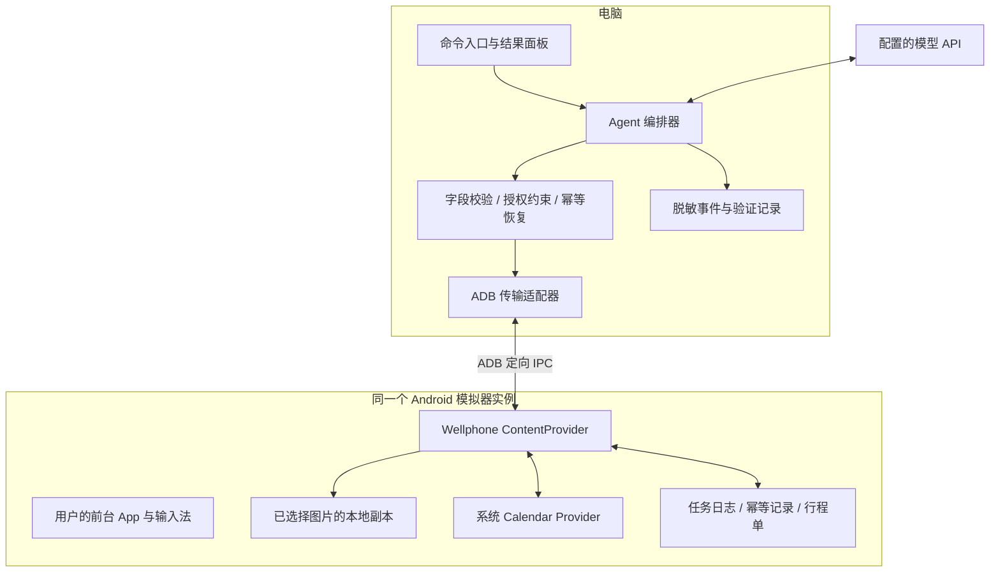

# Wellphone：同机、同时、不抢屏的手机 Agent 设计

日期：2026-09-21。状态：**待评审设计；已核对官方资料和开源源码，尚未实现或做设备实验。**

## 1. 设计决策

按用户确认的设备约束，首版采用 **单个 Android 模拟器 + 电脑 Agent + Android 端受控能力接口**。开发、测试和最终演示均可只用模拟器，真机作为可选补验，不阻塞推进。电脑负责推理与编排；同一个 Android 实例负责读取已授权资料、查询和写入真实系统日历、保存结果，用户继续操作它的前台 App。下文“手机端/设备端”在首版均指此 Android 实例中的 APK 和系统数据。

模拟器版可以证明“同一 Android 实例并发且不抢界面”，不能据此宣称原题要求的物理手机部署已完成。该差异在提交说明中保留；是否接受模拟器替代由出题方决定。

关键选择是让 Agent 直接操作手机提供的数据能力。完成一个日历任务并不必然需要打开日历界面。这样既保留“手机做手脚，电脑/云端做大脑”，也不需要争抢触摸、焦点和键盘。

执行桥选择自研 `ContentProvider`，通过 ADB 按需调用短操作；模拟器用本机 ADB 传输，有真机时再用授权 USB 连接。它无需启动 Activity，也不要求一个长期在后台轮询的服务。Android 官方提供 Provider 按需创建、跨进程调用和日历读写的基础能力；**这些能力组合后的冷启动、权限和无干扰效果仍须设备实验验证**。[资料 R1–R4](../../research/2026-09-21-platform-research.md)

副屏 GUI 作为独立扩展。只有无法通过已有能力完成、且目标 App 通过隔离测试时才使用；首版不自动退回 GUI。iOS 路线保留研究结论，但用户没有 Mac，且通用后台 GUI 与后台时限问题不利于七天内交付。

## 2. 题目约束与交付证据

| 约束 | 设计如何覆盖 | 最终必须展示的证据 |
| --- | --- | --- |
| 同一台手机 | 首版在同一个 AVD 保存输入截图、日历数据库和行程单 | 连接实例标识一致；结果在该实例日历中打开；物理手机项未覆盖 |
| 同时使用 | 任务启动后用户连续打字、滚动；Provider 在后台处理请求 | 手机与电脑同框连续录像；重叠时间内有实际读写操作 |
| 不抢画面/焦点/键盘 | 主线无 Activity 启动、输入注入、输入法切换、通知或剪贴板操作 | 前台窗口/输入法观测加连续实拍；无意外切屏和字符错投 |
| 真实完成 | 生成系统日历事件和手机本地文件 | 按真实 event ID 重读关键字段；演示末尾用户主动打开日历 |
| 可部署 | APK + ADB，无 root 作为目标；先部署官方 AVD | 记录系统镜像、AVD 配置和构建版本；有真机后再补验 |
| GitHub 和简短 README | 设计、源码、部署步骤、环境变量、验证说明 | README 一页内；提交历史清楚；密钥不入库 |

允许提前完成安装、USB 授权、文件选择和权限授予，且这些步骤要在演示中如实交代。任务执行阶段不再弹授权框。用户最后主动打开结果属于验收动作，Agent 不代替用户切屏。

## 3. 三条路线的取舍

| 路线 | 优势 | 主要代价 | 决定 |
| --- | --- | --- | --- |
| A. 手机端语义能力接口 | 无屏幕输入竞争；验证路径短；读写结果可核验 | 只能覆盖已实现且已授权的能力 | **首版主线** |
| B. 同机隐藏副屏 + GUI Agent | 有机会操作更多既有 App，展示更直观 | top focus、单 IME、任务迁移、中文输入、OEM 差异均须处理 | 首版稳定后的扩展 |
| C. iOS 后台任务 / App Intents / Shortcuts | 特定动作可后台执行，能做受限助手 | 无通用第二 UI 会话；后台执行和可见进度有条件；无 Mac 增加开发成本 | 当前不选 |

不选择分屏、悬浮窗或趁用户停顿抢主屏，因为这些方式不能覆盖连续输入场景。另一台云手机、另一个模拟器或纯云端日历 API 可以完成类似业务，但不能独立证明这道题要求的同一手机执行。

这不是“万能手机代理”。创新点是把执行资源从单一屏幕中分离出来，并为每个动作提供可核验的手机端副作用。是否符合评委对“像人”的偏好是产品判断风险，需要用实际有用的多步任务和透明架构说明支撑。

## 4. 首个真实任务：行程截图变成手机日历

示例命令：

> 把我刚选的三张车票、酒店和会议截图整理成行程，检查与已选日历中安排的冲突，把确定的日程放进去，并保存行程单。不确定的地方标出来。

输入是安装设置阶段由用户选中的 3–5 张图片。此时复制到 Companion 私有目录，记录来源、哈希和选择授权；避免任务执行阶段访问云相册时发生下载或授权弹窗。首版不默认读取整个相册，也不扫描用户当前聊天。

执行步骤：

1. 在手机读取此次授权的图片清单，按哈希把图片流传给电脑。
2. 模型提取车次/地点/标题/起止时间/时区，并给每个字段附来源图片和原文片段。
3. 校验必填字段、日期先后、时区和重复条目；只在截图确实包含信息时填入，不凭常识补票面未写明的年份或结束时间。
4. 查询目标时间范围内已选日历的事件实例，检查候选与既有安排、候选相互之间的重叠。首版不检查其他未选日历、不改动已有事件；重试时排除本任务已写入的 event ID，避免把自己误判为新冲突。
5. 对内容明确且位于预授权范围内的条目执行新增；首版固定跳过冲突条目，不擅自改时间。同批候选相互冲突时均标为待处理，不由模型悄悄挑选一个写入。
6. 以真实 event ID 重新查询系统日历；保存包含已写入、已跳过和待确认项的行程单到手机私有目录，经 Provider 可读回。
7. 电脑显示结果和读回证据。用户结束并发测试后，可以主动打开手机日历或 Companion 查看。

示例验收集至少包括两项可确定事件、一项与既有事件冲突的候选、一次重复截图或重试。不是预设“点击三下就成功”；事件内容和执行分支来自实际输入和手机当前状态。

首版新增事件不创建通知提醒、与会者或会议邀请，避免执行期间产生弹窗和外发副作用。若选择云同步日历，需要在设置时说明其正常同步行为；优先使用设备上已有的本地可写日历。

## 5. 架构与数据流

Provider 不承担网络推理或长时间 OCR；每个调用只做小范围查询、文件流读取或有限批次写入。等待模型期间手机端无持续计算任务。所有业务调用固定设备序列号和 Android 用户，避免多个设备连接时操作错对象。

| 组件 | 单一职责 | 依赖 / 边界 |
| --- | --- | --- |
| Companion 设置界面 | 预授权资料、目标日历、时间范围和写入规则 | 只在任务前后由用户主动打开 |
| 能力 Provider | 校验调用者、执行允许的手机能力 | Android ContentResolver；无任意 URI/SQL/命令执行接口 |
| PC 传输适配器 | 结构化请求、文件流、超时和设备身份 | ADB；模型不能直接拼 shell 命令 |
| Agent 编排器 | 根据观察选择步骤，处理缺失信息、冲突和失败 | 模型输出 + 有界工具目录 |
| 校验与授权层 | 时间规则、字段类型、写入范围、重复检测 | 确定性规则；不以模型“自信”替代校验 |
| 结果验证器 | 读回真实手机记录并与计划比较 | 系统日历与手机文件；独立于模型的完成声明 |

## 6. 手机能力协议草案

协议版本为 `v1`。每次请求包含 `request_id`、`job_id`、`method` 和类型化参数；响应包含 `status`、`result`、`error_code`。以下是设计契约，尚未实现。

| 方法 | 输入 | 输出与限制 |
| --- | --- | --- |
| `capabilities` | 协议版本 | 当前授权、可用方法、已选日历、已授权来源摘要 |
| `sources.list` | 本次授权集合 ID | 图片 ID、哈希、尺寸；不暴露任意文件路径 |
| `sources.read` | 图片 ID | 二进制流；只允许读取授权副本，限制大小 |
| `calendar.query` | 时间范围、已选日历 ID | 展开后的事件实例；上限 30 天、200 项，超限返回显式错误 |
| `calendar.commit` | `job_id`、计划摘要哈希、最多 10 个事件 | 写入结果与 event ID；服务端重新校验授权与冲突 |
| `calendar.verify` | 本任务产生的 event ID | 从系统日历重新读取的字段、缺失/变更状态 |
| `jobs.status` | `job_id` | 手机端持久进度、已提交摘要、待恢复项 |
| `reports.write/read` | `job_id`、受限报告数据 | 手机本地报告哈希及内容；不可指定任意写入路径 |

采用 `adb shell content call` 承载小型控制请求，`content read/write` 承载图片和报告流。AOSP 的命令存在不意味着本协议已经存在；首日只验证 `capabilities` 和一条安全读写链路。`content call` 的原始 Bundle 文本不是稳定 JSON，适配器应读取带版本的单一编码字段，或将结果放到专属 URI 再读出。

**调用边界：**

- 演示版显式导出 Provider，仅接受原始 Binder caller 为 shell UID 的请求；本应用自调用如需要则另列明确规则。未授权普通 App 必须失败。使用本机受信 ADB 通路，不向局域网开放；真机的 USB 授权发生在任务前。
- 所有入口包括 `call`、查询和文件流都执行鉴权及路径白名单；不得假设 `call()` 自动继承所有读写权限校验。
- 先记录并校验原始调用者，再通过 `ContentProvider.clearCallingIdentity()` 在自身已授予权限内访问日历；使用 Provider 的对应还原方法在 `finally` 恢复 Binder 和 attribution 身份。不能把调用者提供的任意 URI 转发到系统 Provider。
- 首版限定主用户，拒绝工作资料和跨用户 ID；任务权限在手机端持久化，电脑不得在请求中任意扩大目标日历/时间范围。
- 输入参数采用有界结构化编码和明确的 shell 参数引用，禁止把模型文本拼成命令。限制请求大小、输出大小和并发请求数。
- 正式发布版默认关闭调试桥；本轮目标是受信电脑连接的本地演示部署，不把 ADB 暴露给互联网。

## 7. Agent 与模型职责

使用现有 `.env` 的 `OPENAI_API_KEY`、`OPENAI_BASE_URL`、`LLM_MODEL`。这些变量已配置，但尚未调用服务验证图像输入、响应结构或时延；也不能由变量前缀推断实际服务商和模型能力。

第一版模型适配器仅需要：图像理解、按 schema 返回候选事件、结合工具结果生成下一步请求。不要求服务端原生 tool calling；没有该能力时，由电脑端解析和校验 JSON。若模型不支持图片，先验证可用 OCR + 文本模型；不能在 README 中直接宣称图像能力。

编排循环：观察手机能力与输入 → 形成候选计划 → 校验 → 查询必要状态 → 修订计划 → 提交限定写入 → 独立读回。最多 8 次模型调用，单轮超时和总任务预算可配置；默认演示目标为 90 秒内完成，但必须以实测决定输入规模。

图片文字、事件标题和网页内容都是任务数据。它们不能扩大工具权限或指示 Agent 执行命令。未知字段、非法工具、越界写入和“请忽略规则”类内容会在能力层被拒绝。

## 8. 状态、幂等与失败恢复

状态流：`CREATED → OBSERVING → PLANNED → COMMITTING → VERIFYING → SUCCEEDED`。有跳过项或只完成部分写入时为 `PARTIAL`；需要新授权/人工判断为 `NEEDS_REVIEW`；未完成为 `FAILED`。只有读回全部预期落地记录后才能标记成功。部分完成不能显示“全部办好了”。

手机保存 `job_id`、计划哈希、每项 `operation_id`、写入意图、event ID 和读回摘要。相同 job/plan 重放返回已有状态；相同 job 携带不同计划拒绝，避免断线后悄悄改变任务。

Provider 的 Binder 调用可能并发，不能只依赖电脑单请求约定。手机端对写入采用单写者队列/互斥和任务状态事务；相同 operation 的并发请求返回进行中状态，不同时执行两次新增。重试先走恢复分支，再决定是否允许开始一个尚未提交的操作。

本地任务表与系统日历属于不同 Provider，**没有跨库原子事务**。可能出现日历写成功、任务日志尚未保存的窗口。每个事件在普通应用可写的 `DESCRIPTION` 中记录 `wellphone:<job_id>:<operation_id>` 来源标记；不使用只供同步适配器写入的 `_SYNC_ID` / `SYNC_DATA*`。提交前持久化意图，恢复优先按已知 event ID 读回，再在选定日历按标记查找，不只查原时间窗。

提交结果未知时，查无标记也不能证明没写入，因为用户或同步可能改动记录。找到唯一且字段相符的记录才恢复为成功；无记录、多条匹配或记录发生变化都进入 `NEEDS_REVIEW`，不自动重插。来源标记不承担安全凭证作用。`applyBatch` 只用于目标 Provider 支持的局部原子性，不能替代这套恢复逻辑。

Agent 不删除或覆盖用户已有事件；重复截图按来源与规范化事件内容识别。默认也不自动删除部分成功的新增事件，以免抹除用户随后做出的编辑。回执明确说明已经发生的写入。

| 失败 | 处理 |
| --- | --- |
| 权限撤回、目标日历不存在或只读 | 返回结构化错误；停止依赖该能力的步骤，不弹手机界面 |
| 来源图片缺失、模型没有把握、时间字段不完整 | 生成待确认条目；不猜测并写入 |
| 模型超时 | 有限重试；提交前失败不产生写入，提交后先查手机状态 |
| USB 中断、命令超时 | 标记结果未知；重连同一设备后读取任务和日历状态 |
| 已写事件被用户同时修改 | 读回标记差异；保留用户修改，停止自动覆盖 |
| 主屏出现可归因于 Agent 的切换 | 验收失败；停止后续动作并保留证据，不能靠恢复画面算通过 |

## 9. 并发资源的处理

**输入资源：**主线没有触摸注入、`ime set`、剪贴板输入、无障碍全局操作和 Activity 启动。主屏仍只有用户的输入者。此边界可以由静态调用审计和运行时观测同时核验。

**数据资源：**查询冲突后用户可能新增事件。提交前必须重查相关时间范围；冲突默认跳过。Calendar Provider 并不提供整个“查询冲突→新增”流程的通用串行事务，所以首版保证不覆盖用户记录，不能保证与任意第三方日历写入绝无竞争窗口。提交后再查冲突，并在结果中报告新出现的冲突。

**计算与 IO：**模型在电脑/云端；手机最多单个业务请求，批量读取少量本地副本，图片按需缩放。验收需要比较主屏滚动/打字的性能基线，不把“没有点屏幕”直接等同于“绝不卡顿”。

**声音和可见界面：**主线不启动前台服务、通知、语音播报、悬浮窗或后台 Activity；完成消息放在电脑。Provider 不做无限后台任务，不用伪装音频/定位保活。

**电脑窗口：**模拟器演示时，用户输入焦点保持在模拟器窗口；Agent 使用后台子进程和旁边的被动日志面板，不弹终端、不自动激活窗口、不注入宿主机鼠标键盘。Android 内部隔离和宿主机窗口不抢焦点都要验收。

## 10. 扩展：隐藏副屏 GUI

只有主线闭环完成且还有时间时验证。候选为 Android 14+、shell 身份运行定制 scrcpy server，创建 `TRUSTED + OWN_FOCUS + STEAL_TOP_FOCUS_DISABLED` 副屏。[R6–R10](../../research/2026-09-21-platform-research.md)

重要边界：

- scrcpy v4.1 的 `--new-display` 尚不能直接满足该组合；需要小范围修改 server 并检查实际生效 flag。
- `STEAL_TOP_FOCUS_DISABLED` 的 VirtualDisplay 位为 `1 << 16`，不是转换后的 Display flag 位。它要求可信显示和 own focus，且意味着副屏不能显示 IME。
- `--display-ime-policy=local` 不是双输入法。副屏先验证定向触摸和 ASCII KeyEvents；中文需要目标控件支持明确 display 的 `ACTION_SET_TEXT` 等能力，兼容性不保证。
- 截图、点击、滑动、按键、文本、启动 App 都要绑定副屏；禁止 `monkey` 启动、全局 Home、切换 ADBKeyboard、剪贴板同步和音频作为默认通路。
- 副屏不是独立 Android 用户；同包状态、`singleTask` 和外部 Intent 可能牵动主屏。首轮选不同包，禁用会 force-stop 整包的启动方式。
- 副屏消失、display ID 变化或越界后直接终止；不把操作降级到主屏。保留销毁副屏内容的行为，不把任务搬回主屏。

因此 GUI 能力必须标明“设备 × 系统 × App × 动作”兼容矩阵，不能声称任意 App 都可在后台使用。

## 11. 环境、仓库和阶段范围

当前工作区没有已保存的 `main.py`、应用代码或 Android 工程；已有本地模型环境变量。电脑上有 Python、Git、Java 和 `/dev/kvm`，尚未发现 ADB、scrcpy、Android SDK、模拟器或 Xcode。`/dev/kvm` 存在不代表已通过模拟器硬件加速测试。

计划代码边界为 `companion/`（Kotlin Android）、`agent/`（Python 编排与模型适配）、`tests/`（协议/幂等/设备集成）、`docs/`（设计与验证）。本轮只交付文档及必要的 Git 忽略规则，不提前生成未验证的应用骨架。

首版使用一个官方 API 34/35 AVD，固定镜像版本、内存、分辨率及应用版本，方便保留副屏扩展空间；语义能力主线本身没有已证实的 Android 14 硬依赖。实际最低支持版本由第一轮构建与设备测试决定。有 Android 真机后追加兼容实验，没有也继续完成模拟器演示。

下一阶段首先完成[可行性门槛验证](../../validation/2026-09-21-feasibility-and-demo.md)，再细化实现任务。七天内优先交付一个完整、可核验任务；若 Provider 或模拟器并发门槛未通过，保留失败证据并调整路线，不用纯云结果冒充 Android 端完成。
